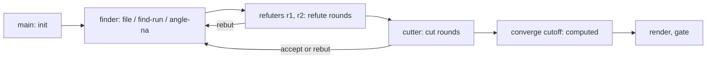

# converge

converge settles the **facts** behind a set of claims. Separate agents find each claim, try
to refute it, and cut it (rate how much it matters). A CLI validates every step against an
append-only ledger and computes which claims are reported. When the facts are agreed but a
decision remains, the claim carries a `choice` for `debate` (see [engine.md](engine.md)). A
factual dispute never goes to debate.

## Components

| Part | Role |
|---|---|
| `plugins/converge/src/converge/` | Python package: `ledger` (file I/O and validation), `model` (replayed state, refute/cut state, cutoff), `config`, `angles`, `render`, `cli` |
| `plugins/converge/src/converge/angles/builtin.yaml` | Built-in `attack`, `evaluate` and `decide` angles |
| `plugins/converge/bin/converge` | Wrapper: `uv run --project <plugin-root> -m converge.cli` |
| `plugins/converge/skills/converge/` | Orchestration skill (modes, roles, rounds, outcomes); `reference.md` gives the rationale |
| `codex-plugins/engine/` | Codex copy: `src/converge/`, `scripts/converge`, `skills/converge/` |

Callers: `review` runs every finding through a `full` slate; the engine `pr-review` and
`ticket-to-pr` machines gate their `review` node on `converge gate`; engine `debate` hands
factual disputes back, briefs parties with the render, and draws its closing angle round from
the `decide` and `attack` angles.

## Slates and modes

A **slate** is one set of claims under test, and one task for the agent budget. Its id
matches `[a-z0-9][a-z0-9._-]{0,80}`.

- `full`: the caller gives lenses and find-angle files. Stages run find → refute → cut →
  cutoff.
- `refute-only`: the caller gives a numbered slate. The orchestrator files every claim as
  agent `slate` (`origin: slate`) before the first refute. There is no find, cut, cutoff or
  gate; the render lists refute outcomes.

`init --snapshot --pass N` commits the work tree, untracked files included, through a
temporary index and pins it at `refs/converge/<slate>`. `--since <prev>` requires
`pass = prev.pass + 1`, records the previous snapshot and prints the `git diff` between the
two. From pass 2, a stricter built-in cutoff replaces `report_if` and `report_if_gap_hunt`.
`converge prune` deletes the refs; engine `execute` prunes them before closing a run.

## Roles and angles

- **Declared agent ids** (`--as`). The CLI allows at most `caps.agents` distinct ids per
  slate (default and maximum 5), the `init` writer included; the reserved ids `slate` and
  `converge` do not count. A claim's finder never refutes or cuts it, its refuters and
  cutters are disjoint, the `init` writer never refutes or cuts, and only the finder may
  `rebut` or `accept`. Ids are trusted as declared: the checks stop accidental
  self-judging, not a lying agent.
- **Allocation.** The skill uses `main`, one `finder` for all lenses, `r1`, `r2` and one
  `cutter`; quick review depth drops `r2`. Each agent is spawned once and continued across
  rounds. `r2` is also the gap-hunt finder (`origin: gap-hunt`), and `r1` refutes its claims.
- **Angles** are rows `{id, tag, tell, asks, field?, lens?, cost?}` with tag `find`,
  `attack`, `evaluate` or `decide`; `(tag, id)` is unique. The built-in table has no `find`
  rows; callers supply them, as review does. The resolved table is builtin + `--angles`
  files + config `angles.files`, minus `angles.disable`. `init` snapshots it, so later edits
  never change an open slate.
- **Coverage.** Every applicable find angle of every lens needs a `find-run` or an
  `angle-na` with a reason.

## Refute and cut

- **Refute rounds.** Each `refute` uses an attack angle not yet used on that claim, and a
  round is complete at ≥2 events. Outcomes: `killed` or `retracted` (the claim is dead and
  accepts nothing more), `downgraded` (`narrowed` replaces the claim text), `survived`,
  `inconclusive`.
- **Refute state.** A claim is **converged** when its latest complete round has no
  `downgraded` outcome and comes after any rebut or reopen. It is **inconclusive** if that
  round contains `inconclusive`, and **unconverged** if `caps.refute_rounds` (5) is reached
  first. A kill or downgrade reopens every claim that `depends` on it.
- **Rebut.** Only the finder rebuts, and only with new evidence: a repeated evidence sha256
  for the same claim and stage is rejected. A refute rebut sends the claim back to refute
  and clears its cut rounds.
- **Cut rounds** (full mode) start once refute is converged, inconclusive or unconverged.
  The cutter sets `frequency`, `severity`, `confidence` and `difficulty`, each backed by an
  evaluate angle. The cut is **converged** when the finder `accept`s the latest round, or
  when the cutter repeats the same four values after a rebut. It is **capped** at
  `caps.cut_rounds` (3). A survived claim with `difficulty` `cross-cutting` or `redesign`
  must carry a `choice`.

## Ledger

- One JSONL file per slate, `<dir>/<slate>.jsonl`. `--dir` defaults to
  `~/.bootgear/converge`; review runs use `<session-dir>/converge`.
- Each line is one event `{seq, ts, event, as, ...fields}`. Types: `init`, `file`,
  `find-run`, `angle-na`, `refute`, `rebut`, `cut`, `accept`, `cutoff`. `seq` is gapless
  from 1, and `init` is written once, first. Claims get ids `F001`, `F002`, …; `loc` is
  `path:line`.
- **Write path:** take an exclusive `flock`, replay and validate the whole file, validate
  the new event against the replayed state, append one line, `fsync`. An invalid event is
  rejected whole, with every problem listed.
- **Read path:** every command replays and validates the whole file; one malformed or
  out-of-order line makes every command refuse it. All derived state (claim, refute and cut
  state, rank, cutoff) is computed on replay, never stored.

## Cutoff and gate

- `converge cutoff` writes the `cutoff` event as agent `converge`; no agent can. It refuses
  while coverage is missing or any claim is open, and every replay re-checks the stored
  results against a fresh computation.
- **Result.** Each live claim is `reported` or `appendix`. Always reported: inconclusive
  and unconverged claims, and claims whose `rule` is in `cutoff.report_rules`. Cut-capped
  claims are reported, and any other claim is reported when it matches a `report_if` rule
  (`report_if_gap_hunt` for gap-hunt claims). A rule maps fields (the four cut fields,
  `origin`, `lens`) to allowed values. Then `caps.per_lens` (3) moves reported claims past
  the cap to the appendix, by rank; only the always-reported claims are exempt, so
  cut-capped claims count toward the cap. Rank is severity, then frequency, then
  confidence. Nothing verified is dropped.
- A current cutoff admits only `rebut` or `refute` next, and either one makes it stale.
- `converge gate <slate> --dir <abs>` exits 0 only when every lens has full coverage, no
  claim is open, and the cutoff is current. It requires an absolute `--dir`. The engine runs
  it as the review node's `leave_check` (see [state-machine.md](state-machine.md)).
- `render` builds Markdown from the ledger alone: reported claims, choices, inconclusive
  and unconverged claims, the appendix, killed and retracted claims with their reasons, and
  coverage.

## Config layers

`converge.yaml` layers deep-merge, later winning: built-in defaults < user
(`~/.claude/converge.yaml`, or `~/.codex/converge.yaml` when `CONVERGE_HOST=codex`) <
project (`<project-root>/.bootgear/config/converge.yaml`) < task (`--config FILE`).
Keys: `cutoff.{report_if, report_if_gap_hunt, report_rules}`,
`caps.{refute_rounds, cut_rounds, per_lens, agents}`, `angles.{files, disable}`. Unknown
keys, bad enum values and non-positive caps are rejected. `init` snapshots the effective
config into the slate.

## Codex bundling

On Claude, converge is its own plugin, and `review` and `engine` declare it as a
dependency. It has no Codex plugin of its own; on Codex it ships inside
`codex-plugins/engine`. `src/converge/` is a byte-identical copy of the package;
`scripts/converge` sets `CONVERGE_HOST=codex` and defaults output to prose;
`skills/converge/SKILL.md` matches the Claude body above `## Host mechanics`, and its host
section spawns native subagents and names the script path.
`codex-plugins/engine/tests/test_bundle_drift.py` fails on any drift in the package, the
skill body, `reference.md` or the review references.
