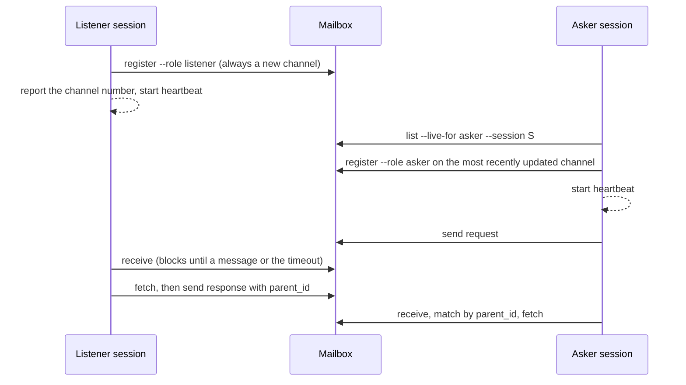

# advisor

> **A second model, one call away.**
> Ask once, or keep it listening.

A session that has settled on a conclusion is the worst reviewer of that conclusion. It chose
the evidence, it wrote the framing, and it reads its own draft as clear. A second model with
different training catches what the first talks itself past: the objection nobody raised, the
sentence that reads two ways, the file nobody opened.

`advisor` connects Claude Code and Codex CLI so either one can ask the other for a rewrite, an
opinion, an adversarial review, or delegated investigation. One plugin directory ships to both
hosts, and either host can sit on either side of the pair.

---

## Two ways to reach the other model

| | `direct` | `channel` |
|---|---|---|
| Mechanism | one `codex exec` call | a request through a shared file mailbox to a live listener session |
| State | none | persistent; survives across turns and compaction |
| What the advisor can see | only the prompt | the files and commands its own session can reach |
| Typical time | 30–60 seconds | minutes, over one or more rounds |
| Platform | wherever the Codex CLI runs | macOS or Linux, with Python 3.11+ and the Codex CLI |

`direct` suits a question whose facts fit in the prompt. `channel` suits a task where the
advisor needs to look things up itself, or the exchange will take several rounds.

Either way, the advisor's answer is advisory. The asking session checks every checkable claim
against the source before relying on it, and returns one reconciled answer, never the banner,
the streamed reasoning or the raw exchange.

---

## Modes and tasks

Every invocation passes an explicit `--mode asking` or `--mode listening`. The skill never
infers the mode from which host is running or from the task; without one, it stops and asks.

**Asking** combines two independent choices, one doc from each row:

| Choice | Options |
|---|---|
| Communication | `direct`, `channel` |
| Task | `rewrite` polishes a draft before posting · `ask` gets a straight opinion or answer · `review` asks for objections and attack angles on a decision · `delegate` hands off investigation or scoped work the advisor does itself (almost always over `channel`) |

**Listening** is a read-only advisor loop. The listener registers a fresh channel, reports its
number, and waits on the mailbox. It answers one request at a time and keeps listening until
it receives a `stop`, the user interrupts, or the channel closes; when the asker's seat reads
dead it closes the channel with `close --if-peer-stale`, which refuses and keeps it listening
if the asker is live again or a request is waiting. An asker silent past the 10-second TTL at
that moment counts as dead and cannot rejoin the closed channel. It never starts a
conversation, never answers the human directly for a mailbox request, and takes no commit,
push, external contact, production mutation or irreversible action unless the request's scope
explicitly authorizes it.

---

## Pairing through the mailbox



- **A channel is a one-time lease kept alive by a heartbeat.** Each of its two seats,
  `listener` and `asker`, records the owner's session ID and a `seen_at` stamp. After
  `register`, the owner runs `heartbeat` in the background; it stamps every 3 seconds, and a
  seat is live while the stamp is under 10 seconds old. Only the owner's `--session` can
  refresh it; ownership is a string match on the session ID within the owner-only mailbox, not
  an authentication. `heartbeat` ends with one JSON line whose `next` names the follow-up:
  `channel_closed`, `max_age` (6180 seconds; `next` restarts it, and the seat stays live for a
  720-second restart grace meanwhile, so at most 6900 seconds in all), `signal` (SIGTERM, SIGINT or
  SIGHUP), `seat_taken` when this session does not hold the seat, or the errors
  `heartbeat_failed` (three failed stamps in a row, an unreadable or missing record included),
  `channel_missing`, `invalid_args` and `invalid_role`. After a restart, the same session ID
  can register its seat again and start a new heartbeat; any other session gets `seat_claimed`. A dead seat reads stale
  within 10 seconds after a normal host exit; after a crash, kill or terminal close an orphaned
  heartbeat keeps the seat live up to its maximum age plus the restart grace. A stall over 10 seconds makes a live
  seat read stale until its next beat.
- **The asker claims, it never creates.** It picks the most recently updated open channel from
  the last 48 hours whose listener is live and whose asker seat is free or its own; a busy
  listener counts as taken and may be absent. If the claim loses a race, it rescans once and
  claims once more, then stops. With no candidate, it waits only for a listener it started
  itself or the user said is starting, and otherwise tells the user to start a listener.
- **Replies are matched by `parent_id`, not arrival order.** `send` refuses when the
  recipient already holds two unread messages, or when its seat is not live
  (`peer_not_live`; a `stop` is always accepted).
- **`receive` never changes state**, so a session resuming after compaction can call it cold
  and pick up a response that arrived while it was away.
- **Nothing is guessed around.** A malformed message, the wrong recipient, an unmatched
  `parent_id` or a closed channel is a protocol error.

The mailbox is owner-only: `channel.py` sets directories to `0700` and files to `0600` on
every call. Channel files are written atomically; changes to an existing channel take its
channel lock, and allocating a new channel takes the allocator lock.

Design detail, including the on-disk layout, lives in [docs/advisor.md](../../docs/advisor.md).

---

## Commands

| | |
|---|---|
| `/advisor:advisor --mode asking` (Codex: `$advisor:advisor --mode asking`) | ask the other model, one-shot or through the mailbox |
| `/advisor:advisor --mode listening` (Codex: `$advisor:advisor --mode listening`) | open a channel and advise the paired session until stopped |

The mailbox CLI underneath is `skills/advisor/scripts/channel.py`, one copy shared by both
hosts:

```
register  take a seat: a listener gets a new channel, an asker claims an existing one
init      print a channel's directory path, creating the directory (not a channel record)
heartbeat keep a seat live; run in the background after register
list      list channels; --live-for asker --session S shows the ones an asker can claim; --wait N waits for one
send      post a request, response or stop
receive   wait for an unread message; prints previews of the last three and a next command
fetch     read a message's full body and mark it read
state     record waiting, busy or closed for a role
close     close the channel; --if-peer-stale closes only if the peer is not live and nothing unread waits
status    show a channel's record
```

---

## Setup

Install the plugin on each host that will use it:

```
/plugin marketplace add vancsj/bootgear
/plugin install advisor@bootgear
```

```
codex plugin marketplace add vancsj/bootgear
codex plugin add advisor@bootgear
```

Requirements:

- macOS or Linux (POSIX); Windows is not supported.
- Python 3.11 or later.
- The same advisor version (1.2.0) on both hosts of a pair: a listener from an older version
  stamps its seat on a different cadence, so its liveness reads wrong.
- The Codex CLI, installed and signed in, for `direct` mode.

On Codex CLI, the mailbox root sits outside the sandbox's writable roots, so every
`channel.py` call runs with escalated sandbox permissions.

Configuration:

| Variable | Effect |
|---|---|
| `BOOTGEAR_ADVISOR_DIR` | mailbox root; defaults to `~/.bootgear/advisor` (`--root` overrides it) |
| `BOOTGEAR_ADVISOR_CODEX_MODEL` | model for `direct` calls; unset leaves Codex's own default |
| `BOOTGEAR_ADVISOR_CODEX_EFFORT` | reasoning effort for `direct` calls; unset leaves Codex's own default |

`direct` runs `codex exec` read-only from an empty scratch directory with the user's Codex
config and rules ignored, so no hooks fire on the call. That is why the model and effort come
from these variables rather than from the Codex config file.

---

## Standalone, or as bootgear gear

Nothing here depends on the rest of bootgear — install it on its own if a second opinion is
all you want. `engine` installs it as a dependency and uses it on Claude Code to bring Codex into its debates.
