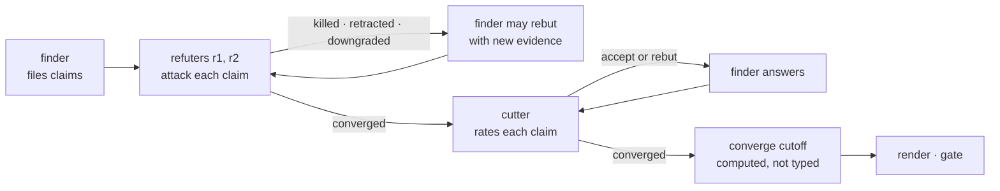

# converge

> **Arguing does not settle facts. Reading and running do.**
> Find it, try to kill it, then rate what survives.

A review produces a list of claims: this call can return null, that branch is unreachable,
this migration loses data. Some are right, some are wrong, and some are true only in a
narrower form. When the agent that found a claim is also the one that judges it, it is
invested in its own finding, and a plausible-sounding false positive reaches the report
unchallenged.

converge separates the parties. One agent finds each claim, different agents try to refute
it, another rates how much it matters, and none of them sees another role's reasoning. A CLI
validates every step against an append-only ledger and **computes** which claims are
reported, so no agent types "reported" into existence.



Default verdicts point against the claim: refute defaults to refuted, cut defaults to cut. A
claim reaches the report only on shown evidence.

---

## Two modes

| Mode | The caller gives | Stages |
|---|---|---|
| `full` | an artifact, lenses, and find-angle files | find → refute → cut → cutoff |
| `refute-only` | an artifact and a numbered slate of claims | refute only; the render lists each claim's outcome |

A **slate** is one set of claims tested together. `refute-only` is the standalone use: hand it
an existing list of findings and it refutes them until a round changes nothing.

---

## Roles

At most five agents per slate, the orchestrator included. Each role is spawned once and
continued across rounds.

| Role | Agent id | Does |
|---|---|---|
| main | `main` | orchestrates; writes `init`, and in `refute-only` files the slate's claims |
| finder | `finder` | every find angle of every lens (`full` only) |
| refuter | `r1` | attacks each claim with angles not yet used on it |
| refuter | `r2` | like `r1`; also the gap-hunt finder when the caller asks for one |
| cutter | `cutter` | rates every surviving claim (`full` only) |

The CLI enforces the separation: a claim's finder never refutes or cuts it, its refuters and
cutters are disjoint, and only the finder may rebut or accept. Agent ids are declared, so the
checks stop an agent accidentally judging its own work, not a lying one.

---

## Refute: fresh angles until nothing moves

Each refute round uses at least two **attack angles** never used on that claim before —
`boundary`, `reachability`, `guarded-elsewhere`, `positive-control`, `real-referent` and ten
more ship built in (`converge angles --tag attack` lists them). A quiet round on a reused angle
is a repeat; two fresh angles that change nothing is convergence.

| Outcome | Meaning |
|---|---|
| `killed` | the claim is false |
| `retracted` | its referent does not exist in the artifact |
| `downgraded` | true only in a narrower form; the narrowed text replaces the claim |
| `survived` | withstood the angle, with evidence cited |
| `inconclusive` | no available source settles it, and the refuter names what would |

A rebuttal must carry new evidence — the CLI hashes it and rejects a repeat. A kill or
downgrade reopens every claim that depends on it. Refute is capped at five rounds; a claim
still moving then is `unconverged` and always reported.

---

## Cut: rate what survives

The cutter sets four fields per claim, each backed by an **evaluate angle**:

| Field | Values |
|---|---|
| `severity` | `security`, `data-loss`, `wrong-behavior`, `degraded`, `cosmetic` |
| `frequency` | `every-call`, `common`, `rare`, `contrived` |
| `confidence` | `reproduced`, `traced`, `inferred` |
| `difficulty` | `trivial`, `local`, `cross-cutting`, `redesign` |

The finder, the party with the opposite stake, answers each round with `accept` or a rebut.
A cut converges on accept, or when the cutter repeats the same values after a rebut; it is
capped at three rounds. When the facts are agreed but a fix still needs a decision, the claim
carries a `choice` — handed on for a decision, never argued as a fact.

`converge cutoff` then sorts every live claim into **reported** or **appendix** from the cut
fields and the configured rules. Inconclusive and unconverged claims are always reported.
Cut-capped claims and claims matching a `report_if` rule are reported too, up to three per
lens by default, ranked by severity, then frequency, then confidence. Nothing verified is dropped — below the line means appendix.

---

## Commands

| | |
|---|---|
| `/converge:converge` (Codex: `$engine:converge`) | run a slate in `full` or `refute-only` mode through the role agents |

The skill drives the `converge` CLI; on Claude Code the plugin's `bin/` is on `PATH`, on
Codex the skill calls the engine plugin's `scripts/converge`.

```
init        start a slate: mode, lenses, angle files; --snapshot pins the work tree
file        file a claim
find-run    record that a find angle was run
angle-na    record why a find angle does not apply
refute      record one attack angle's outcome on a claim
rebut       the finder answers a refute or cut with new evidence
cut         record a claim's four cut fields
accept      the finder accepts a cut round
status      claims, their refute and cut state, unused angles
converged   whether the refute or cut phase has converged
coverage    which find angles are still unaccounted for
cutoff      compute reported vs appendix
gate        exit 0 only with full coverage, no open claim, a current cutoff
render      Markdown report built from the ledger alone
angles      list the resolved angle table
config      validate or resolve the layered configuration
prune       delete the snapshot refs of finished slates
```

Every command that reads a slate's ledger replays and validates it whole first; one malformed
line makes each of them refuse the slate. `prune` (which only deletes snapshot refs), `angles`
and `config` read no ledger. `--json` or `--prose` picks the output format.

---

## Setup

Prerequisites: `git`, Python 3.11 or later, and [`uv`](https://docs.astral.sh/uv/), which
runs the CLI.

```
/plugin marketplace add vancsj/bootgear
/plugin install converge@bootgear
```

On Codex CLI there is no separate install: converge ships inside the `engine` plugin
(`codex plugin add engine@bootgear`).

Ledgers are one JSONL file per slate under `~/.bootgear/converge/` unless `--dir` says
otherwise. Configuration layers deep-merge, later winning: built-in defaults, then the user
file (`~/.claude/converge.yaml`, or `~/.codex/converge.yaml` on Codex), then the project's
`.bootgear/config/converge.yaml`, then a task file passed with `--config`:

```yaml
cutoff:
  report_if: [...]          # field → allowed values; a match is reported
  report_if_gap_hunt: [...] # stricter rules for gap-hunt claims
  report_rules: [...]       # claim rules that are always reported
caps: {refute_rounds: 5, cut_rounds: 3, per_lens: 3, agents: 5}
angles: {files: [...], disable: [...]}
```

`init` snapshots the effective config and angle table into the slate, so later edits never
change an open one. Design detail: [docs/converge.md](../../docs/converge.md).

---

## Standalone, or as bootgear gear

converge works on its own: `refute-only` needs nothing but an artifact and a list of claims.
Inside bootgear, `review` settles every finding through a `full` slate, `engine` gates its
review step on `converge gate`, and engine's `debate` takes the claims that carry a `choice`.
If `memory-ledger` is installed, refuters consult it for deliberate decisions and converge
records facts that outlive the artifact there; without it, converge notes its absence and
carries on.
