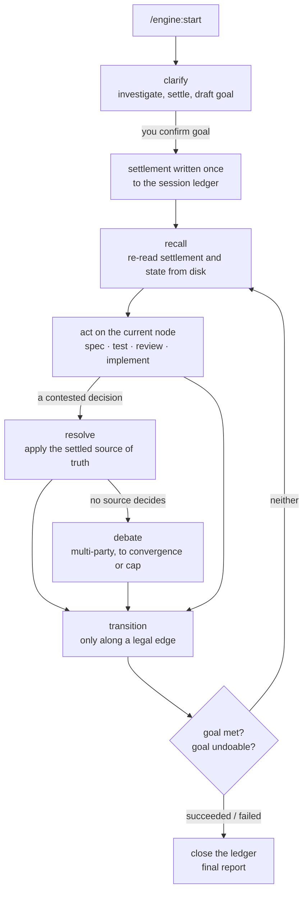
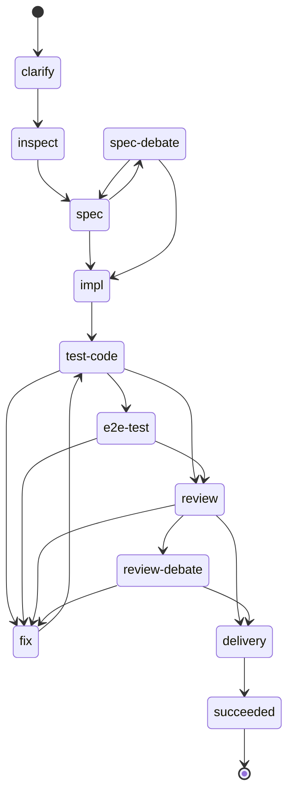

# engine

> **Ask once, then run to a verdict.**
> One clarification stage, then an unattended loop that ends `succeeded` or `failed`.

A coding agent left alone on a real task drifts in predictable ways. It asks a question every
few steps, so it is never really unattended. It forgets what was agreed once the context
compacts. It settles a hard-to-reverse choice on its own, or re-argues an easy one forever.
And it stops when it stalls, without saying whether the task was done, impossible, or just
stuck.

`engine` splits a task into two parts. **`clarify`** is the only stage that asks you work
questions: it investigates the request, and agrees with you on the task type, the workflow, who
is authoritative on what, which decisions need a debate, what the agent may change without
asking, and a `goal` with explicit *succeeded when* and *failed when* conditions. That
agreement, the **settlement**, is written once to a ledger on disk. **`execute`** then runs
unattended against it, re-reading the ledger from disk every iteration, until the goal resolves.



---

## What clarify settles

| Item | What it fixes |
|---|---|
| Request assessment | observed scope, a `small`/`medium`/`large` estimate and the files or commands behind it |
| Task type | exactly one of `ticket-writing`, `bug-triage`, `ticket-to-pr`, `pr-review` |
| State machine | the workflow graph for this run, validated and shown to you as a diagram |
| Approach and principles | the concrete steps, and the run-wide constraints (merged with project and user principles) |
| Source of truth, per domain | who decides scope and outcome, current behaviour, implementation approach, correctness |
| Debate threshold | which decisions are too hard to reverse or too broad to make alone; reversibility and blast radius by default |
| Autonomy | an explicit list of permitted mutations (commit, push, open a PR, post review comments, ...) — "go ahead autonomously" is not a list |
| Domain-skill overrides | a project skill to use in place of `spec`, `test` or `review`, whole or per sub-task |
| `goal` | what the task is, and the concrete *succeeded when* and *failed when* conditions |

After you confirm `goal`, no further work questions are asked. The one exception is recovering
the ledger's location when a compaction has lost it.

---

## The run is a state machine

Each task type has a built-in machine: a YAML graph of named nodes and legal edges. Every node
carries a reminder saying what to do there and which skill does it. The ticket-to-PR machine:



Every non-terminal node can also move to `failed`.

`task state transition` is a hard gate, not a log: it refuses a move that is not a legal edge,
a node entered more than its `max_visits`, or leaving a node whose `leave` condition was not
asserted. A node can also carry a `leave_check` — a command the engine runs itself, such as
`converge gate` on every review node, which blocks leaving until the review's findings are
settled. You approve every `leave_check` command at `clarify`.

| Task type | Built-in path |
|---|---|
| `ticket-writing` | inspect → spec → (spec-debate) → succeeded |
| `bug-triage` | inspect → triage → (triage-debate) → succeeded |
| `ticket-to-pr` | inspect → spec → impl → test-code → (e2e-test, fix) → review → delivery → succeeded |
| `pr-review` | inspect → review → (review-debate, fix) → succeeded |

A project can replace a built-in machine wholesale with
`.bootgear/config/state-machine-<task_type>.yaml`, and `clarify` can adjust it for one run —
for example, dropping `fix` from a review of a PR you did not author. Once written, the machine
changes only through `task state amend`, which appends a new version.

---

## Disagreements: resolve, then debate

Most decisions are made alone and recorded with their basis. A decision at or above the debate
threshold goes to **`resolve`**, which classifies its domain and applies the source of truth
settled for that domain — the ticket for scope, the code and its tests for current behaviour.

Only when no settled source decides does **`debate`** run. It argues choices, never facts: a
dispute that reading code or running a check can settle goes back to `converge`. The default
roster is three parties — the main agent, an independent reviewer and an adversarial reviewer.
On Claude Code the adversarial reviewer asks Codex through `advisor`; on Codex both reviewers
are native subagents. Round 0 settles scope; later rounds answer each other; the debate closes
by unanimous convergence, a consented stop, the round cap (10 by default), or degraded
convergence when parties are unavailable.

---

## The session ledger

All run state lives in one Markdown file per run, `~/.bootgear/session/<run-id>.md` by default,
keyed by the host session id and outside every repository. It holds the settlement, an
append-only decision trail, open todos, progress reports, and the state-machine position.
Only the `task` CLI writes it; skills read it through `task session` and `task state`, never from
memory. A settled item changes only through an explicit `AMENDMENT` decision.

Three hooks keep a long run on track, each reading the ledger by session id:

| Hook | Reminds the agent to |
|---|---|
| session start | run `recall` after a compaction, with the run's `goal` and merged principles |
| stop | run `recall` before ending a turn while a run is open |
| state nudge | transition when the current node has had no transition for 5 minutes |

A run started with a custom `--dir` gets no hook reminders. Detail:
[engine](../../docs/engine.md), [state machine](../../docs/state-machine.md),
[session ledger](../../docs/session-ledger.md).

---

## Commands

| | |
|---|---|
| `/engine:start` (Codex: `$engine:start`) | start a new run; hands your request to `clarify` |
| `engine:clarify` | settle the run with you and write the settlement |
| `engine:execute` | the unattended loop, after `goal` is confirmed |
| `engine:recall` | re-read settlement, amendments, todos and current node from disk |
| `engine:resolve` | settle a disagreement from the settled source of truth, or escalate |
| `engine:debate` | multi-party debate for a choice `resolve` cannot settle |

`start` is the only one you invoke. The other five are internal: the loop calls them itself,
so they are listed by skill name rather than as a command to type.

The CLI underneath is `bin/task` (`scripts/task` in the Codex build), run through `uv`:

```
task session   init · validate · read · record-decision · next-question-id · update-todo · record-pitch · close
               (Codex build also: recall)
task state     transition · current · amend · show · validate · diagram
task config    resolve layered config, such as the debate-party roster
```

---

## Setup

Prerequisites: `git`, Python 3.11 or later, and [`uv`](https://docs.astral.sh/uv/). On Claude
Code, the adversarial debate party asks Codex through `advisor`, so the Codex CLI needs to be
installed and signed in.

Claude Code:

```
/plugin marketplace add vancsj/bootgear
/plugin install engine@bootgear
```

This installs `engine`'s declared dependencies with it: `converge`, `spec`, `test`, `review`,
`advisor` and `memory-ledger`.

Codex CLI:

```
codex plugin marketplace add vancsj/bootgear
codex plugin add engine@bootgear
```

The Codex build bundles `spec`, `test`, `review` and `converge`. Add `memory-ledger@bootgear`
too if you want runs to look up and record durable facts; its absence never blocks a run.

Project customisation lives in `.bootgear/config/`: `principles.md`, a
`state-machine-<task_type>.yaml` override, and layered YAML config such as
`debate-parties.yaml`. See the [design overview](../../docs/README.md).

---

## Standalone, or as bootgear gear

`engine` is the one bootgear plugin that is built from the others: it delegates specs to
`spec`, tests to `test`, reviews to `review`, fact disputes to `converge`, a second opinion to
`advisor`, and durable facts to `memory-ledger`. Each of those works on its own; `engine` is
the loop that drives them to a verdict.
