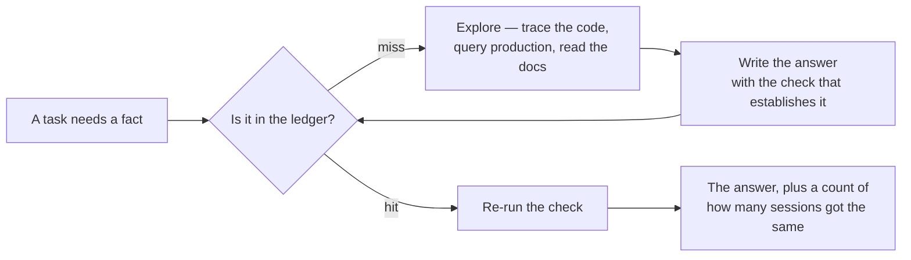
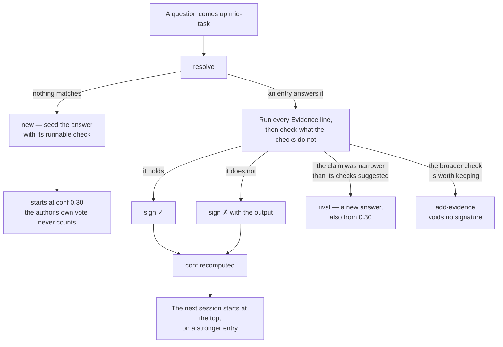
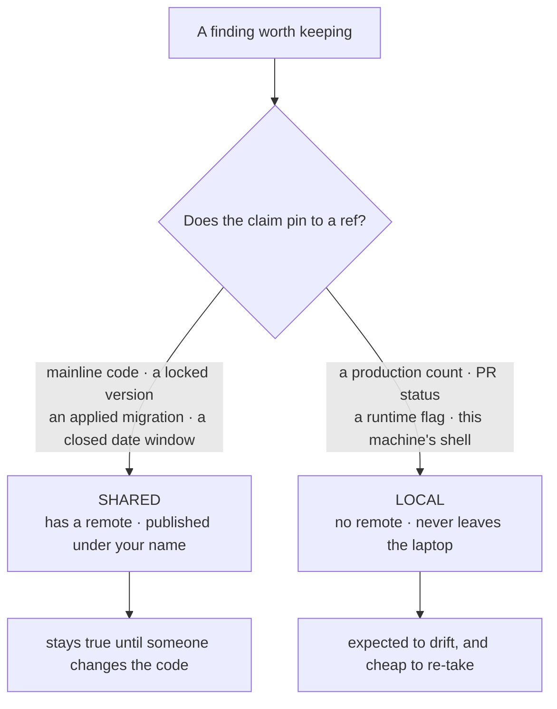
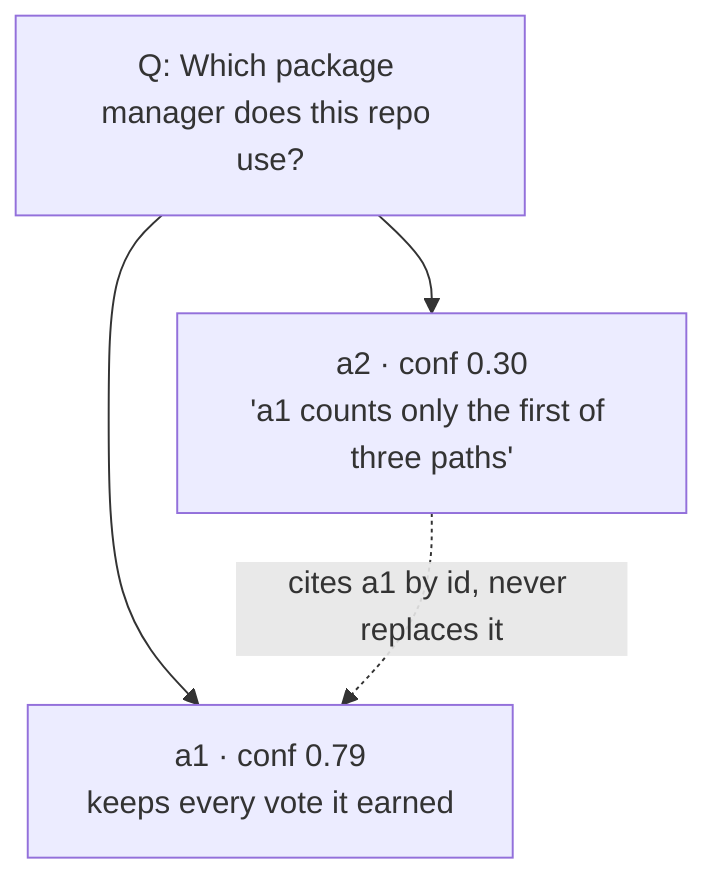

# memory-ledger

> **The model is the CPU. This is its cache.**
> Retrieve to work, verify to vote.

An answer that costs a session twenty minutes — tracing a call path across four files, querying
production, reading a vendor's docs to the line that actually decides — costs the next session
the same twenty minutes, and the one after that. Nothing accumulates. The exploration is
expensive, the result is small, and it is recomputed every time.

A cache fixes that by storing the result of an expensive computation under the key that asked
for it. Here the key is **the question**, the value is **the answer plus the command that
re-establishes it**, and the cache line is validated by re-running that command rather than by
trusting its age.



Every entry is one question. Each answer carries a claim, why it matters, and one or more
**checks** — usually a shell command, but a check naming a non-shell tool ("`<Tool>: <what to
ask it>`") is just as valid, since a session's tools are not only a shell. A session that uses
an answer re-runs its checks and signs the result. Confidence is computed from those
signatures — never typed.

---

## Why questions rather than wiki pages

It builds on [Karpathy's LLM wiki](https://gist.github.com/karpathy/442a6bf555914893e9891c11519de94f):
collect raw sources, have the model compile them into linked pages, and let the knowledge
compound instead of being re-retrieved per query. That part is kept here. What changes is
**the unit**.

A wiki page is the shape a *person* produces. You decide a topic exists, gather what belongs
under it, and arrange it — structure first, then content poured in.

**A model does not think that way.** It asks a question, proposes an answer, and looks for
something that would prove the answer wrong. Question, hypothesis, check. So the stored unit
is that same triple rather than a topic page:

| | Wiki | This |
|---|---|---|
| Unit | a topic | **a question** |
| Written by | synthesis across sources | **the check that settles it** |
| Two views differ | one page, reconciled by editing | **two answers, both kept, each with its own votes** |
| Trust | the page is as good as its last editor | **a count of independent sessions that re-ran the check** |

Three things follow from that choice, and they are the whole design:

1. **An answer is a hypothesis until something runs its check**, so every answer ships with a
   command rather than a citation.
2. **Two sessions can disagree**, so the entry holds rival answers side by side and lets the
   tally speak — no editor reconciles them into one paragraph.
3. **Confidence is a count, not a claim** — how many independent sessions re-derived the same
   result, which is the one thing a page's prose can never tell you.

---

## An entry

```markdown
# tech/stack/package-manager
Q: Which package manager does this repo use?
alt_terms: npm or pnpm, lockfile, workspaces, how do I install

## a1 · pnpm for all installs              conf 0.49 · checked 2026-03-05
Because: workspaces performance; ~10x smaller installs than npm.
Evidence: test -f pnpm-workspace.yaml && head -1 pnpm-workspace.yaml
Evidence: test ! -f package-lock.json
    ✓ 1f0c9a2e        2026-03-02  h=7f3a92  e=1  (author)
    ✓ codex:5b7d31c4  2026-03-04  h=7f3a92  e=1
    ✗ 9e42d0b7        2026-03-05  h=7f3a92  e=2
    > cat: pnpm-workspace.yaml: No such file or directory
```

- **`Q:`** is the entry's identity. Only the question is searched, so two similar claims stay
  separate entries unless they answer the same question.
- **`alt_terms:`** are the phrasings someone would type not knowing this entry exists.
- **`Evidence:`** lines are shell commands or a named tool call. Append-only.
- **`h=`** covers the claim, `Because:` and `Ref:`. Editing any of them voids every signature
  on that answer; appending a check voids none.
- **`e=`** is how many checks the answer carried when that signature was cast, so a shallow
  signature is visible as one.
- **`>`** is what a failing run actually printed, recorded under the signature that cast it.

---

## The loop



The step that carries the weight is **checking what the checks do not**. An `Evidence:` line
was chosen because it passes, so re-running it confirms the check rather than the claim. A
grep matching nothing asserts the pattern is absent, not the thing; a count asserts what the
query returned, not that it captured the population; a config default asserts what is
declared, not what is in effect.

---

## Confidence is counted, not typed

```
conf = (1 − 0.70 × 0.55^yes) × 0.80^no
```

`yes` and `no` count **independent verifiers** — the author's own signature is excluded, and
one session signs an answer once.

| Signatures | conf | Band |
|---|---|---|
| author alone | `0.30` | unconfirmed |
| 1 independent ✓ | `0.61` | confirmed |
| 2 independent ✓ | `0.79` | well-confirmed |
| 2 ✓ + 1 ✗ | `0.63` | confirmed |
| 6 ✓ + 1 ✗ | `0.78` | well-confirmed |
| any number of ✓ | `0.99` | well-confirmed — the ceiling |

**The signatory is the AI session, not the human.** One person across a hundred sessions is
one opinion, and accumulates nothing.

**A `✗` is a vote, never a veto.** A deterministic check cannot pass for one session and fail
for another, so both marks on one body is a finding about the *check* — it turns on something
it does not name.

**Agreement stops at `0.99`.** `1.00` is a human's ruling — `assert`, for a question no check
can settle: an intent, a decision, a system that no longer exists to be queried. It writes an
`Asserted:` line naming who ruled and why, suspends the tally's hold on the header, and
suspends nothing else: signatures keep accumulating, `show` prints what they count, and `lint`
reports the answer as contested while a `✗` stands. A pin is not a veto either.

**Nothing is hidden at any confidence.** Every answer is returned at every level; the number
says how much company you are in, and the check decides.

---

## Two ledgers



Separate repositories, not folders. Git history is append-only, so a machine-local fact
committed to a shared ledger cannot be taken back out once that ledger has a remote.

Three shapes rot fastest, because someone is actively working to make each false: **in-flight
work state**, **open-ended production counts**, and **"not yet" negatives under active
development** — a negative that follows from a design decision is durable, one that means
"nobody has done it" is a countdown.

---

## Disagreement adds, never deletes



An answer that contradicts, narrows or corrects another is a **rival**: a new answer on the
same question, starting at `0.30`, inheriting no votes. The answer it argues with keeps what
it earned.

**Answer bodies are immutable.** Other answers cite each other by id, so a body that could
change would leave every citation pointing at moved text and every signature signing bytes
nobody can reconstruct. There is no `Superseded-by:` and no ordering — which answer is right
is a judgement the reader makes by running the checks.

---

## Commands

| | |
|---|---|
| `/memory-ledger:setup` (Codex: `$memory-ledger:setup`) | check dependencies, create the ledgers, wire the config file and the host instructions file (`~/.claude/CLAUDE.md` or `~/.codex/AGENTS.md`), audit what is already filed |
| `/memory-ledger:ledger` | look something up, record a finding, verify or contest an entry |

The CLI underneath is `scripts/ledger.py`. The skills invoke it by an absolute path
substituted at load time, so nothing needs to be on `PATH`.

```
resolve   find the entry, or mint a slug for a new one
show      read one entry: answers, conf, evidence, signatures, recorded output
new       seed an answer with its check
sign      record your verdict; conf recomputes
refute    cast an opposing vote against a specific signature
assert    pin an answer at 1.00 on a human's ruling; --clear lifts it
rival     add a competing answer to the same question
add-evidence   append a check to a signed answer
lint      drift, voided signatures, folder shape, collisions
save      lint --fix, then one commit per ledger
doctor    python, git, config, both roots
```

---

## Setup

Install the plugin, then run `/memory-ledger:setup` (Codex: `$memory-ledger:setup`). It reports
`doctor`'s dependency table before touching anything, and every write outside the ledger
repositories — the config file, the host instructions file, a git remote, a push — needs your
explicit yes.

Roots default to `~/.memory-ledger/shared` and `~/.memory-ledger/local`, and are configured in
`~/.memory-ledger/config.yaml`:

```yaml
memory:
  root: <the shared ledger's path>
  local_root: <the local ledger's path>
```

`$LEDGER_ROOT` / `$LEDGER_LOCAL_ROOT` override the file; `--root` / `--local-root` override
those.

---

## Standalone, or as bootgear gear

Nothing here depends on the rest of bootgear — install it on its own if the ledger is all you
want.
