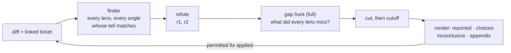

# review

> **A finding is a claim until someone else fails to kill it.**
> Look through every lens, then let converge decide what survives.

An agent reviewing a diff and then checking its own findings is not independent: the
assumption that produced a false positive also approves it. And a review that only reports
what it thinks matters hides everything else it saw, so "no comments" cannot be told apart
from "nothing looked for".

`review` splits the work. One finder looks at the diff through a set of **lenses**, each
with its own **find angles**, and files every claim it makes into a
[converge](../converge) slate. Separate agents refute and rate each claim, and the converge
CLI computes which are reported. Every claim is filed before any cutoff runs, so what falls
below the bar lands in the appendix rather than disappearing.



How claims are refuted, rated and cut is converge's job; see its [README](../converge) and
[docs/converge.md](../../docs/converge.md).

## Lenses and depth

| Lens | Depth | Finds |
|---|---|---|
| `correctness` | quick, full | where the code does not do what the change claims, for some reachable input or order of events |
| `tests` | quick, full | changed behaviour no test would catch breaking, and tests that cannot fail |
| `security` | full | a path by which an untrusted input or caller gets an effect or data it should not |
| `architecture` | full | a design choice with a tell in the diff and a cost scenario shown in this repo |
| `simplicity` | full | code the change could drop or shrink with the same behaviour |
| `contract` | full | a caller or consumer that a changed API, schema, CLI, event or file format breaks |

`quick` runs four agents (main, finder, one refuter, cutter) and no gap hunt. `full`, the
default, adds a second refuter, who afterwards hunts for gaps: what every lens missed, and
whether the ticket and the diff match in both directions (asked but missing, present but
unasked). An unlabelled call never silently gets the lighter pass.

**Find angles** are specific questions with a *tell*, the sign in the diff that makes the
question worth asking: `changed-contract`, `removed-behavior`, `boundary-input`,
`test-cant-fail`, `ticket-diff` and seven more. The `architecture` lens adds a catalog of 39
design failure patterns (`layer-leak`, `hidden-coupling`, `premature-abstraction`,
`god-object`, ...), each with the cost it makes harder. The finder declares the angles whose
tell matches and records every other one as not applicable, so coverage is checkable.

## Applying feedback

A claim that survives converge is real, not accepted. Acceptance is per comment: an explicit
agreement to that comment, or that comment marked resolved as agreed. A question, no reply,
or an overall PR approval does not count. After applying a change, `review` runs the
affected suite and accounts for every in-scope comment as `applied`,
`accepted but not applied`, `rejected or won't-fix`, or `unclear`.

"Apply the accepted comments on this PR" skips the findings pass entirely.

A new review loops (review, apply what the mode permits, re-review) and ends with one outcome:

| Outcome | Means |
|---|---|
| `handoff` | in an engine run whose node has a `fix` edge, the mode would apply at least one claim; review returns the fix list and applies nothing |
| `comment_only` | in an engine run whose node has no `fix` edge; every surviving claim is reported and none applied |
| `clean` | no reported, inconclusive or unconverged claim remains |
| `below_cutoff` | only appendix claims remain |
| `blocked` | a reported claim needs an acceptance, a decision or a permission that is not there, or a claim is inconclusive or unconverged |
| `no_progress` | the same claim came back unchanged after a fix, with no new information |
| `iteration_cap` | the cap (default 5) ended the loop with live claims |

Standalone, the mode is `accepted_only`: nothing is applied without an outside signal.

## Project standard and overrides

A project can commit `.bootgear/config/review-standard.md`: rules headed `## R### [severity]`
with a `severities:` list and a `cutoff:`. The finder tags each claim that breaks a rule, and
a surviving claim tagged with a rule at or above the cutoff is always reported.

Before its own review, `review` looks for a more specific skill: inside an `engine` run it
reads `review_override` from the settlement (a skill name, or a map keyed by depth);
standalone it uses the current project's own review skill when one fits. See
[docs/README.md](../../docs/README.md).

## Commands

| | |
|---|---|
| `/review:review` (Codex: `$engine:review`) | review a diff, branch or PR, or apply its accepted comments |

## Setup

```
/plugin marketplace add vancsj/bootgear
/plugin install review@bootgear
```

This installs `converge` with it. On Codex CLI, `review` has no separate install: it is
bundled into the Codex `engine` package (`codex plugin add engine@bootgear`).

## Standalone, or as bootgear gear

`review` works on its own, with converge as its one dependency; a standalone caller answers
the claims that carry a `choice` itself. Installed with `engine`, it runs the review step of
a run: `engine` gates leaving that step on `converge gate`, applies the fix list in its `fix`
node, and sends each `choice` to its `review-debate` node.
