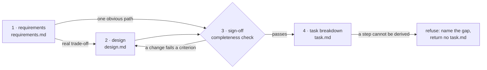

# spec

> **Settle what to build before building it.**
> Open questions are listed, never guessed.

An agent handed a ticket tends to start typing. The requirements it never wrote down, the
design choice it made without noticing there was one, the step it improvised halfway through
the implementation: each is a decision nobody reviewed. `spec` separates finding out what is
needed from deciding how to build it, and makes the final checklist something that needs no
further decision.

It runs up to four stages, and skips the ones a small task does not need:



| Stage | Returns |
|---|---|
| requirements | `requirements.md`: what the task must do, constraints, out-of-scope items, current behaviour and where it lives, the compatibility target; plus a list of open questions |
| design | `design.md`: what changes, where, and in what order, with the options considered and what each rejected one would have cost |
| sign-off | the signed-off shape, or the specific trade-off still open |
| task breakdown | `task.md`: an ordered checklist, each step traceable to one statement in the signed-off doc |

Each stage returns its artifact and a suggested path; the caller decides where files live.

## The completeness check

Sign-off reads the skeleton doc (`design.md`, or `requirements.md` when design was skipped)
against four criteria, each checked by reading:

1. Every change names a file and the function, section or heading within it.
2. Every change states the resulting behaviour, not only the edit.
3. The changes have a stated order, or are declared order-independent.
4. No change is left open, such as "TBD", "depends on", or "either X or Y".

A failure sends the doc back to design, naming the criterion and the change. Because only a
passing doc reaches the task breakdown, that stage never makes a judgement call: it derives
the checklist, or refuses and names the missing statement.

## Skeleton and notes

`requirements.md` and `design.md` are terse skeletons: bullets over prose, only the facts the
check reads. Rationale, rejected alternatives and cited `memory-ledger` entries go in a paired
`requirements-notes.md` / `design-notes.md`. The check never reads a notes file, so a fact
that lives only there cannot make an incomplete skeleton pass.

## Overrides

Before its own stages, `spec` looks for a more specific skill to hand off to:

- **Inside an `engine` run**, it reads `spec_override` from the run's settlement: a skill
  name for the whole task, or a map keyed by stage (`requirements`, `design`, `sign-off`,
  `task`).
- **Standalone**, it uses the current project's own spec skill when one matches the task.

An override must return the same artifacts each stage defines. See
[docs/README.md](../../docs/README.md) and [docs/engine.md](../../docs/engine.md).

## Commands

| | |
|---|---|
| `/spec:spec` (Codex: `$engine:spec`) | run the stages for a ticket, bug report or request |

## Setup

```
/plugin marketplace add vancsj/bootgear
/plugin install spec@bootgear
```

On Codex CLI, `spec` has no separate install: it is bundled into the Codex `engine` package
(`codex plugin add engine@bootgear`).

## Standalone, or as bootgear gear

`spec` works on its own; a standalone caller answers the open questions itself. Installed
with `engine`, it drafts the spec in `ticket-writing` and `ticket-to-pr` runs, and each open
trade-off goes to `engine`'s `spec-debate` node, which settles it through `resolve` and, if
needed, `debate`. `spec` never calls either itself.
