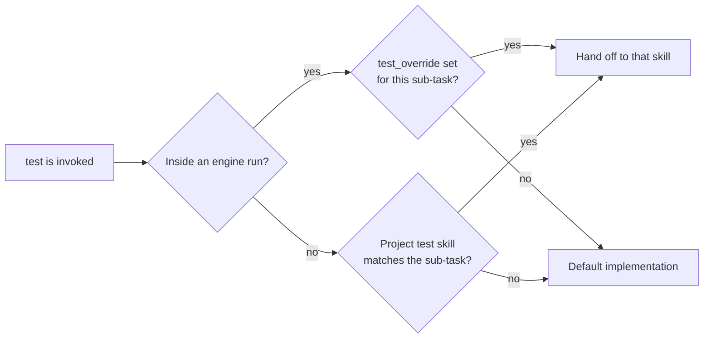

# test

> **A test result is something you ran, not something you read.**
> Every failure gets its own verdict and its own evidence.

An agent asked whether a change works is tempted to answer from the diff. It reads the code,
decides the tests would pass, and reports a result nobody observed. When a run does fail, the
same shortcut folds several failures into one explanation guessed from a test's name. `test`
keeps the three jobs apart — writing cases, running them, triaging what failed — and ties
each reported result to the exact command and the output it printed.



| Sub-task | What it does | Reports |
|---|---|---|
| writing cases | cases for the stated behaviour and its edge cases, in the project's existing framework | location and coverage |
| running tests | runs the relevant suite | the exact command and its actual pass/fail output, or that it was not run |
| triage | classifies each failure as a real regression, a flaky or environmental failure, or an incorrect test | one classification per failure, with its error text or stack trace, and whether it blocks |

Only the sub-tasks a request needs are run. A small change gets a few cases and the relevant
tests; a large or high-risk change gets wider coverage, integration or end-to-end runs as well
as unit tests, and evidence for every failure.

## A project test standard

If the project has `.bootgear/config/test-standard.md`, `test` applies its rule IDs when
writing cases and cites the rule behind each one. The file lists `severities:` and a
`cutoff:`, then rules as `## R### [severity]`. A regression that cites a rule blocks when the
rule's severity is at or above `cutoff`, and is reported as non-blocking below it. A
regression with no cited rule, or in a project with no standard, blocks. See
[docs/README.md](../../docs/README.md) for the project config files.

## Overrides

- **Inside an `engine` run**, `test` reads `test_override` from the run's settlement, and
  any later amendment to it: a skill name for every sub-task, or a map keyed by the exact
  sub-task label `execute` passes. With no match it uses its own default and does not search
  further.
- **Standalone**, it uses the current project's own test skill when one matches the sub-task.

An override must report in the same per-sub-task format. See
[docs/engine.md](../../docs/engine.md).

## Commands

| | |
|---|---|
| `/test:test` (Codex: `$engine:test`) | write cases, run tests, or triage a failure for a change or requirement |

## Setup

```
/plugin marketplace add vancsj/bootgear
/plugin install test@bootgear
```

On Codex CLI, `test` has no separate install: it is bundled into the Codex `engine` package
(`codex plugin add engine@bootgear`).

## Standalone, or as bootgear gear

`test` works on its own and needs nothing else from bootgear. Installed with `engine`, it
runs the `test-code` and `e2e-test` nodes of `ticket-to-pr` runs and reproduces the report in
the `triage` node of `bug-triage` runs. Its report feeds `execute`'s todo updates and goal
check; `test` never decides whether the broader task is complete.
